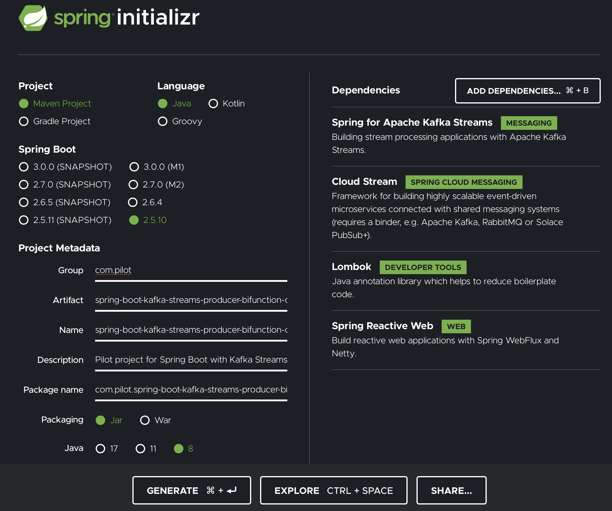

# Common HowTo's 

## Build initial spring project from Spring Initializer
Use bash to get your initial spring project from [start.spring.io]() following the Spring's User Guide for [Command line support](https://docs.spring.io/initializr/docs/0.4.x/reference/html/command-line.html)
```bash
  export PROJECT_NAME="spring-boot-kafka-streams-producer-bifunction-consumer"
  curl https://start.spring.io/starter.zip \
    -d dependencies=kafka-streams,cloud-stream,lombok,webflux \
    -d groupId="com.pilot" \
    -d artifactId=$PROJECT_NAME \
    -d name=$PROJECT_NAME \
    -d description="Pilot project of Spring Boot with Kafka Streams for SMS Delivery Filtering" \
    -d javaVersion=1.8 \
    -d build=maven \
    -d packaging=jar \
    -d bootVersion=2.5.7 -o $PROJECT_NAME.zip
```
Or use your browser at [start.spring.io](https://start.spring.io/)


In fact, what is missing from this initial setup and need to be added in pom file are the following dependencies for 
jackson and swagger lib's:

```xml
    <dependencies>
        <!-- initial dependencies -->
        <dependency>
            <groupId>com.fasterxml.jackson.datatype</groupId>
            <artifactId>jackson-datatype-jsr310</artifactId>
        </dependency>
<!--        <dependency>-->
<!--            <groupId>org.springdoc</groupId>-->
<!--                <artifactId>springdoc-openapi-ui</artifactId>-->
<!--            <version>1.5.2</version>-->
<!--        </dependency>-->
    </dependencies>
```

## Connect to your kafka container
List the docker containers, store the first list to a *kafka_id* and use this variable to docker exec inside the kafka
container
```bash
    kafka_id=`docker ps |grep kafka | awk '{print $1}' | head -1`
    docker exec -it $kafka_id /bin/sh 
```
or use the one-liner for mac to add it to alias

```bash
    docker ps |grep kafka | awk '{print  $1 " bash"}'  | head -1 | xargs -o docker exec -it
```

and the then, while we are inside the container, change directory to */opt/kafka/bin/* to get access of kafka bash
scripts.

```bash
    cd /opt/kafka/bin/
```

## One-liner for cleaning docker containers and their images
In the following command, *docker-compose* updeploy the containers, *docker rmi* remove app's image, and finally the
last part *prune*, in other words removes, all the available containers.

```bash
    docker-compose down && docker rmi app && docker container prune
```

##  Check the Dependency Tree
```bash
    mvn dependency:tree

    [INFO] Scanning for projects...

```

